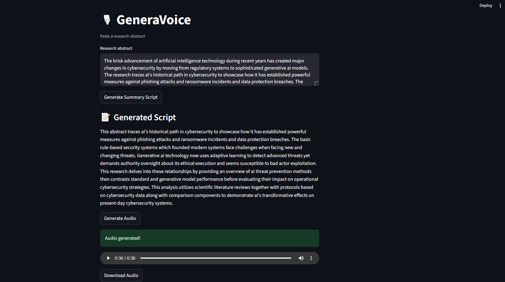

#  GeneraVoice
GeneraVoice is a free, Hugging-Face–powered Streamlit app that turns any research abstract into a AI-generated narration with downloadable audio

Turn any **research abstract** into a **narrated explainer**.  
Built with **Hugging Face (FLAN-T5 + SpeechT5)** and **Streamlit** — all free, no pro/paid voices.

## Features
- **Generative text** → concise narration from your abstract (`google/flan-t5-base`)
- **Generative audio** → speech from narration (`microsoft/speecht5_tts` + `microsoft/speecht5_hifigan`)
- **Simple UI** → paste, click, listen, download WAV


## Quick Start

```bash
git clone https://github.com/AnisulMahmud/GeneraVoice.git
cd GeneraVoice
python -m venv .venv
# Windows PowerShell
.\.venv\Scripts\Activate.ps1

pip install -r requirements.txt
streamlit run app.py
```


>  Note: This project uses **open, non-premium**. Voice quality and pronunciation may vary, and speaking rate can be faster than human speech. That’s expected for free models.

